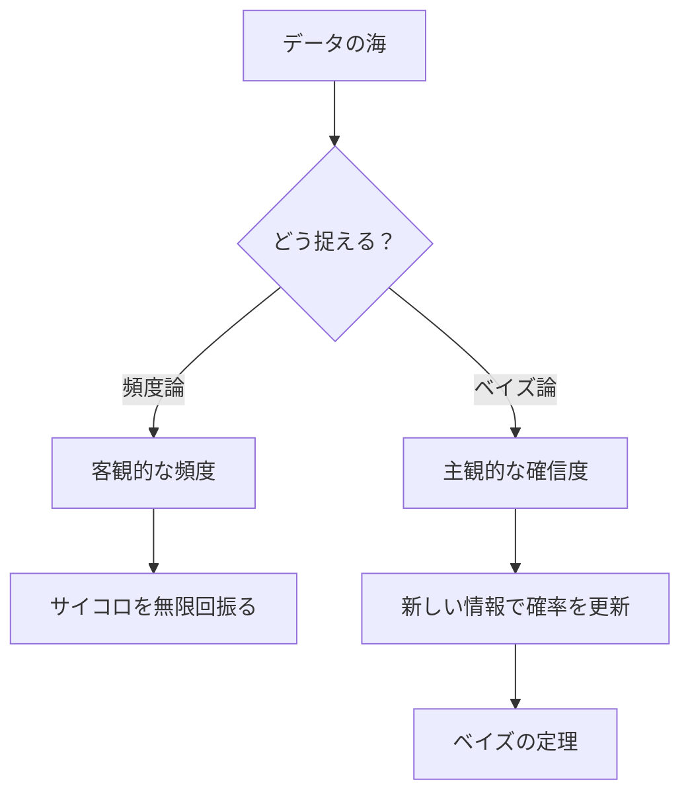
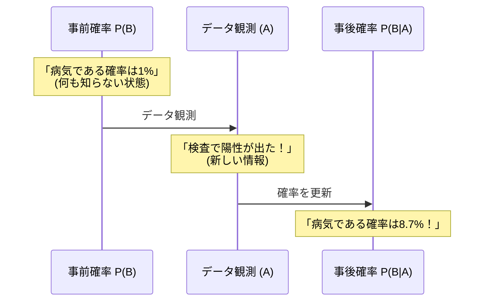

## この知識はいつ使うの？

*   **データから未来を予測したいとき**: 「過去のデータ（条件）」に基づいて「未来の確率」を計算する（天気予報、故障予測）。
*   **新しい情報で予測をアップデートしたいとき**: 検査結果が出た後に、病気の確率を再計算する（ベイズ更新）。
*   **機械学習モデルの基礎理解**: ナイーブベイズ分類器などのアルゴリズムの仕組みを知りたいとき。

## 全体像：確率の世界地図

確率には大きく分けて2つの考え方があります。どちらも重要ですが、現代のデータサイエンスでは特に「条件付き確率（ベイズ）」の考え方が重要になります。



## 1. パターンで理解する「条件付き確率」

「ある条件 $B$ が起こった世界において、事象 $A$ が起こる確率」を考えます。
全体を見るのではなく、**条件 $B$ というフィルターを通した世界**だけを見るのがポイントです。

$$ P(A|B) = \frac{P(A \cap B)}{P(B)} $$

### 具体例：サイコロの目

| パターン | 条件 ($B$) | ターゲット ($A$) | 考え方 | 確率 |
| :--- | :--- | :--- | :--- | :--- |
| **全体** | なし (全6通り) | 偶数が出る | $\{2, 4, 6\}$ の3通り | $3/6 = 50\%$ |
| **条件付き** | **4以上が出る** ($4,5,6$) | 偶数が出る | 条件下で偶数は $\{4, 6\}$ の2通り | $2/3 \approx 66.6\%$ |

条件（フィルター）がかかることで、分母が小さくなり、確率が変わる様子がわかります。

## 2. 確率の更新：ベイズの定理

条件付き確率の公式を変形すると、**ベイズの定理**が得られます。
これは「結果から原因を推測する」ための最強のツールです。

$$ P(B|A) = \frac{P(A|B)P(B)}{P(A)} $$

### 理解のためのフローチャート



*   **事前確率**: データを見る前の確率（例：一般的に病気にかかっている確率）。
*   **尤度（ゆうど）**: 原因 $B$ があったときに、結果 $A$ が出る確率（例：病気の人が陽性になる確率）。
*   **事後確率**: 結果 $A$ を知った後の、原因 $B$ の確率（例：陽性だった人が、本当に病気である確率）。

## Pythonでの実装：シミュレーションで確認

「偶数が出た（条件B）」ときに「4以上（事象A）」である確率を、数式を使わずにシミュレーション（10万回サイコロを振る）で求めてみましょう。

```python
import numpy as np

# 1. 10万回の実験
N = 100000
dice = np.random.randint(1, 7, N)

# 2. 条件B: 偶数が出る
condition_B = (dice % 2 == 0)

# 3. 条件Bを満たすデータだけを抽出（フィルタリング）
subset_B = dice[condition_B]

# 4. その中で事象A(4以上)が起きている割合を計算
prob_A_given_B = np.mean(subset_B >= 4)

print(f"条件付き確率（シミュレーション）: {prob_A_given_B:.4f}")
# 理論値 2/3 ≈ 0.6666 に近くなるはず
```

## Rでの実装：ベイズ更新の計算

検査薬の例（感度95%、特異度90%、有病率1%）を計算してみます。直感に反する結果を確認しましょう。

```r
# パラメータ設定
prior <- 0.01          # 事前確率 P(病気)
sensitivity <- 0.95    # 感度 P(陽性|病気)
specificity <- 0.90    # 特異度 P(陰性|健康)

# 全確率の公式で P(陽性) を計算 (分母)
# P(陽性) = P(陽性|病気)P(病気) + P(陽性|健康)P(健康)
prob_positive <- (sensitivity * prior) + ((1 - specificity) * (1 - prior))

# ベイズの定理で事後確率 P(病気|陽性) を計算
posterior <- (sensitivity * prior) / prob_positive

cat(sprintf("検査陽性の人の実際の有病率: %.1f%%", posterior * 100))
```

## まとめ

*   **条件付き確率は「フィルタリング」**: 全体を見るのではなく、特定の条件下の世界を見る。
*   **ベイズの定理は「学習」**: 新しい情報（データ）を得るたびに、認識（確率）をアップデートしていくプロセス。
*   **直感は当てにならない**: 特に「偽陽性」の問題など、計算してみると直感とズレることが多いので注意が必要。
