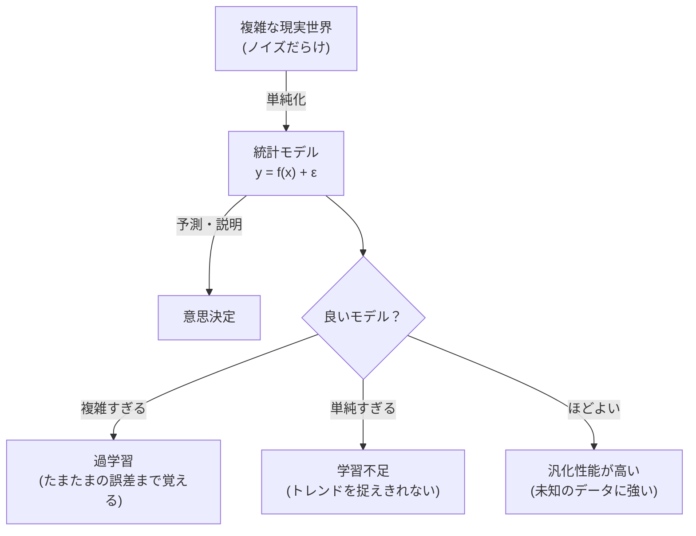

## この知識はいつ使うの？

*   **モデル選択**: 「複雑なモデル」と「シンプルなモデル」、どっちを採用すべきか悩んだとき。
*   **過学習の防止**: データに合わせすぎて、未知のデータに弱くなってしまう現象を防ぎたいとき。
*   **科学的説明**: 「この現象は、この数式で説明できる」と主張したいとき。

## モデリングとは「地図作り」

現実は無限に複雑ですが、すべてを記述することはできません。
必要な要素だけを抜き出して、扱いやすくしたものが**モデル**です。

> 「すべてのモデルは間違っているが、いくつかは役に立つ」 (George Box)



## モデル選択の基準 (AIC / BIC)

良いモデルとは、**「データへの当てはまりが良く」かつ「シンプルである」**ものです。
これを数値化したのが**情報量規準**です。

| 指標 | 名前 | 式（イメージ） | 特徴 |
| :--- | :--- | :--- | :--- |
| **AIC** | 赤池情報量規準 | $-2 \ln(L) + 2k$ | **予測の良さ**を重視。予測モデルならこれ。 |
| **BIC** | ベイズ情報量規準 | $-2 \ln(L) + k \ln(n)$ | **真のモデル**を見つけることを重視。パラメータ数 $k$ へのペナルティが厳しい。 |

*   $L$: 尤度（当てはまりの良さ）
*   $k$: パラメータ数（モデルの複雑さ）
*   $n$: データ数

**小さいほど良いモデル**です。「当てはまりの悪さ（マイナスの尤度）」と「複雑さのペナルティ」の合計だからです。

## Pythonでの実装：AICによるモデル選択

多項式回帰（1次、2次、3次...）で、どの次数がベストかをAICで選んでみます。

```python
import numpy as np
import matplotlib.pyplot as plt
from sklearn.preprocessing import PolynomialFeatures
from sklearn.linear_model import LinearRegression
from sklearn.metrics import mean_squared_error

# 真の関数（2次関数） + ノイズ
np.random.seed(42)
X = np.random.rand(20, 1) * 10
y = 3 * X**2 + 2 * X + 5 + np.random.randn(20, 1) * 10

# AICを計算する関数 (簡易版: 線形回帰の場合)
def calculate_aic(n, mse, num_params):
    likelihood = -n/2 * (1 + np.log(2*np.pi)) - n/2 * np.log(mse)
    return -2 * likelihood + 2 * num_params

degrees = [1, 2, 8] # 1次(直線), 2次(正解), 8次(過学習)
plt.figure(figsize=(12, 4))

for i, deg in enumerate(degrees):
    poly = PolynomialFeatures(degree=deg)
    X_poly = poly.fit_transform(X)
    
    model = LinearRegression()
    model.fit(X_poly, y)
    y_pred = model.predict(X_poly)
    
    mse = mean_squared_error(y, y_pred)
    aic = calculate_aic(len(y), mse, deg+1)
    
    ax = plt.subplot(1, 3, i+1)
    plt.scatter(X, y, color='blue')
    
    # プロット用に滑らかな線を作る
    X_plot = np.linspace(0, 10, 100).reshape(-1, 1)
    y_plot = model.predict(poly.transform(X_plot))
    plt.plot(X_plot, y_plot, color='red')
    
    plt.title(f"Degree {deg}\nAIC: {aic:.1f}")

plt.show()
```

結果を見ると：
*   **Degree 1 (直線)**: 当てはまりが悪く、AICが高い（学習不足）。
*   **Degree 2 (2次)**: 当てはまりが良く、AICが**最も低い**（ベストモデル）。
*   **Degree 8 (複雑)**: データ点全てを通ろうとぐにゃぐにゃしており、AICは逆に高くなる（過学習）。

## Rでの実装：step関数による変数選択

Rの `step` 関数を使うと、AICが最小になるように変数を自動で増減させてベストなモデルを選んでくれます（ステップワイズ法）。

```r
# mtcarsデータセット
# 最初はすべての変数を入れたフルモデルを作る
full_model <- lm(mpg ~ ., data = mtcars)

# step関数でAIC最小化 (backward: 変数を減らしていく)
best_model <- step(full_model, direction="backward")

summary(best_model)
```

## まとめ

*   モデル作りは「複雑さ」と「当てはまり」のトレードオフ。
*   **AIC** は予測精度重視、**BIC** は真のモデル探索重視。どちらも**小さい方が良い**。
*   パラメータを増やせば当てはまり（$R^2$など）は必ず良くなるが、それは「過学習」かもしれない。AICでペナルティを与えて公平に比較しよう。
