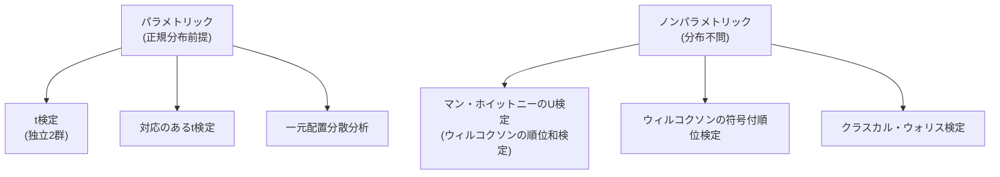

## この知識はいつ使うの？

*   **データ数が極端に少ないとき**: $n=5$ くらいしかなくて、ヒストグラムを描いてもボコボコで正規分布かわからないとき。
*   **外れ値があるとき**: とんでもなく大きな値が1つ混ざっていて、平均値が使い物にならないとき。
*   **順位データ（アンケート）**: 「1位〜5位」のようなデータで、平均値を計算するのが適切でないとき。

## パラメトリック vs ノンパラメトリック

| 特徴 | パラメトリック (t検定など) | ノンパラメトリック (順位和検定など) |
| :--- | :--- | :--- |
| **前提条件** | データが特定の分布（正規分布など）に従うこと | **分布を仮定しない** (Distribution-free) |
| **使う統計量** | 平均値、分散 | **順位 (Rank)**、中央値 |
| **メリット** | 検出力が高い（差を見つけやすい） | どんなデータでも使える（頑健性） |
| **デメリット** | 前提が崩れると結果が間違っているかも | 情報の一部（具体的な値）を捨てるので、検出力は少し落ちる |

## どの検定を選べばいい？ (対応表)

t検定などに対応するノンパラメトリック版が必ず存在します。



## 仕組み：なぜ「順位」を使うのか？

例えば `[1, 2, 1000]` というデータがあった時、平均値は `334` になりますが、これでは `1000` に引きずられすぎです。
これを順位に変換すると `[1位, 2位, 3位]` となり、`1000` という極端な値の影響（外れ値）をマイルドにできます。

これがノンパラメトリック検定が「外れ値に強い」理由です。

## Pythonでの実装：マン・ホイットニーのU検定

独立な2群の比較（対応なしt検定の代わり）を行います。

```python
from scipy import stats
import numpy as np

# A群：普通のデータ
group_A = [10, 12, 14, 15, 18]
# B群：外れ値を含むデータ（平均値比較だとBが勝ってしまうかも？）
group_B = [20, 22, 25, 26, 1000] 

# マン・ホイットニーのU検定（順位に基づいた検定）
u_stat, p_val = stats.mannwhitneyu(group_A, group_B, alternative='two-sided')

print(f"U統計量: {u_stat}")
print(f"p値: {p_val:.4f}")

# ちなみにt検定だと...
t_stat, t_p_val = stats.ttest_ind(group_A, group_B)
print(f"t検定のp値: {t_p_val:.4f}")
```
外れ値があっても、順位検定なら「B群の方が全体的に大きい」という傾向をロバストに捉えられます。

## Rでの実装：ウィルコクソンの符号付順位検定

対応のあるデータ（前後比較など）の差を検定します。

```r
# 対応のあるデータ (Before -> After)
before <- c(80, 75, 90, 60, 70)
after  <- c(85, 70, 95, 75, 80)

# 差を計算
diff <- after - before
# 正の差: 4つ, 負の差: 1つ。
# 増えている傾向があるか？

# ウィルコクソンの符号付順位検定
wilcox.test(before, after, paired=TRUE)
```

## まとめ

*   **データが汚い、少ない、外れ値がある**ときは、迷わずノンパラメトリック検定を検討する。
*   具体的には、**値を「順位」に変換**して検定する。
*   代表選手は「マン・ホイットニーのU検定（2群比較）」と「クラスカル・ウォリス検定（3群比較）」。
