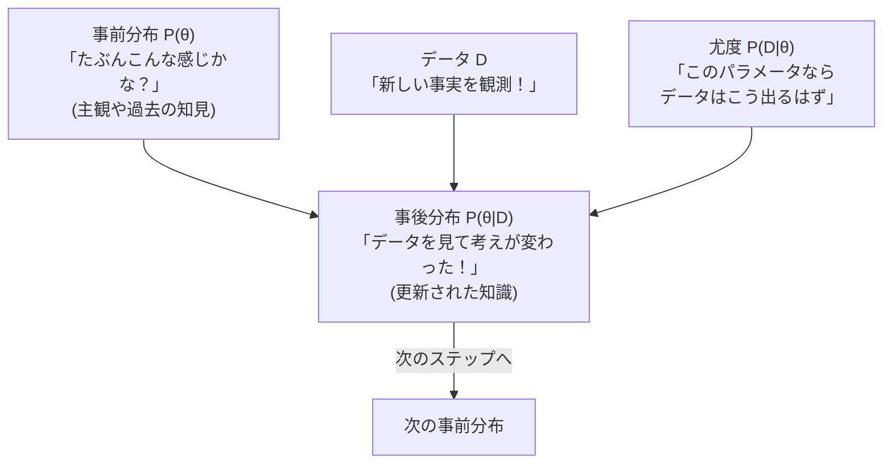

## この知識はいつ使うの？

*   **データが少ない段階での意思決定**: 新商品を発売した直後でデータが少なくても、過去の類似商品のデータ（事前知識）を使って予測したいとき。
*   **パラメータの分布を知りたい**: 単に「平均50」と言うだけでなく、「45〜55に分布している確率が高い」という確率的な幅を知りたいとき。
*   **随時更新**: 毎日入ってくるデータを使って、リアルタイムにモデルを賢くしていきたいとき。

## 伝統的な統計 vs ベイズ統計

| 項目 | 伝統的統計学 (頻度論) | ベイズ統計学 |
| :--- | :--- | :--- |
| **パラメータ** | **定数** (神のみぞ知る真の値が1つある) | **確率変数** (分布として揺らいでいる) |
| **確率の解釈** | 無限回繰り返した時の頻度の極限 | データから得られた**確信の度合い** |
| **推定結果** | 点推定値、信頼区間 | **事後分布** (全体像がわかる) |

## ベイズ更新のフロー

ベイズ統計は「学習」のプロセスそのものです。



$$ \underbrace{P(\theta | D)}_{事後分布} \propto \underbrace{P(D | \theta)}_{尤度} \times \underbrace{P(\theta)}_{事前分布} $$

## 計算の壁とMCMC (マルコフ連鎖モンテカルロ法)

事後分布を数式できれいに解くのは、積分計算が難しすぎて不可能なことが多いです。
そこで、**「サイコロを振りまくって（乱数シュミレーション）、事後分布の形を浮かび上がらせる」**という力技を使います。これが **MCMC** です。

*   **Stan** や **PyMC** といったツールがこれを自動でやってくれます。

## Pythonでの実装：PyMCによるベイズ推定

「コイン投げで表が出る確率 $p$」を推定します。データは「10回投げて8回表 ($N=10, k=8$)」です。
データが少ないですが、事前知識（事前分布）として「コインだから普通は0.5くらいだろう」という情報を入れるか、「何も知らない（一様分布）」とするかで結果が変わります。

```python
import pymc as pm
import arviz as az
import matplotlib.pyplot as plt

# データ: 10回中8回表
n_trials = 10
n_heads = 8

with pm.Model() as model:
    # 1. 事前分布: 何も知らないので一様分布 Beta(1, 1) = Uniform(0, 1)
    # もし「公平なコインっぽい」と知っていれば Beta(10, 10) などにする
    p = pm.Beta('p', alpha=1, beta=1)
    
    # 2. 尤度: 二項分布
    obs = pm.Binomial('obs', n=n_trials, p=p, observed=n_heads)
    
    # 3. MCMC実行 (サンプリング)
    trace = pm.sample(1000, chains=2)

# 結果の可視化
az.plot_posterior(trace)
plt.show()
```

結果分布（事後分布）の山頂（平均やモード）が、推定された $p$ の値です。$8/10=0.8$ 付近にピークが来ますが、データが少ないので裾野は広くなります。

## Rでの実装：解析的に解く（共役事前分布）

ベータ分布と二項分布の組み合わせ（共役）なら、MCMCを使わなくても手計算で解けます。

*   事前分布: $Beta(\alpha, \beta)$
*   データ: $n$回中$k$回成功
*   事後分布: $Beta(\alpha + k, \beta + n - k)$

```r
# グリッドを作って密度関数を描画
p_grid <- seq(0, 1, length.out=100)

# 事前分布 Beta(1, 1) = 一様分布
prior <- dbeta(p_grid, 1, 1)

# 事後分布 Beta(1+8, 1+2) = Beta(9, 3)
posterior <- dbeta(p_grid, 9, 3)

plot(p_grid, posterior, type="l", col="red", lwd=3,
     main="Bayesian Update", xlab="Probability p", ylab="Density")
lines(p_grid, prior, col="blue", lty=2)
legend("topleft", legend=c("Prior", "Posterior"),
       col=c("blue", "red"), lty=c(2, 1))
```

青い線（平坦）から、赤い線（0.8付近に山）へ、データによって知識が更新された様子がわかります。

## まとめ

*   **ベイズ統計**は、パラメータを「分布」として捉える。
*   **事前分布**（事前の思い込み）と**尤度**（データ）を組み合わせて、**事後分布**（新しい知識）を作る。
*   複雑なモデルでも **MCMC**（乱数シミュレーション）を使えば推定できる。これが現代AIの基礎技術の一つになっている。
