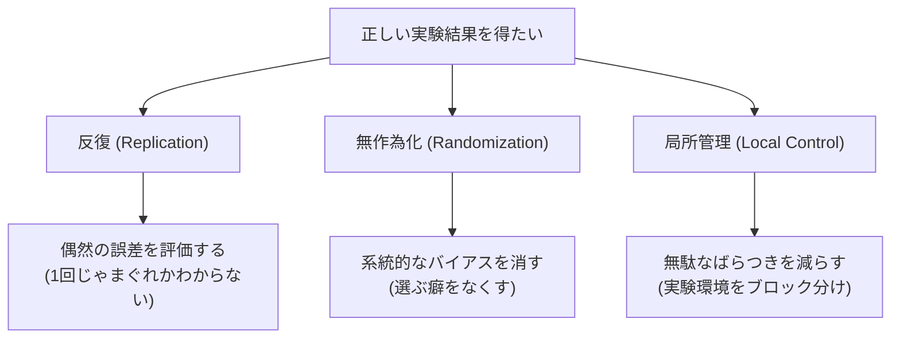

## この知識はいつ使うの？

*   **製品開発**: 新しいケーキを作るとき、「小麦粉の種類」「砂糖の量」「焼き時間」のベストな組み合わせを見つけたいが、全部試すと100通り以上あって無理なとき。
*   **Webマーケティング**: ボタンの色、キャッチコピー、画像配置などを同時にテストし、どの要素が効いているかを知りたいとき。
*   **農場試験**: 土地の場所による栄養の偏りなどをキャンセルして、純粋な肥料の効果を測定したいとき。

## フィッシャーの三原則

近代統計学の父、R.A.フィッシャーが提唱した、実験を成功させるための3つの鉄則です。



1.  **反復**: 同じ条件で何度か繰り返せ（推定精度の向上）。
2.  **無作為化**: 順番や配置をランダムにせよ（系統誤差の排除）。
3.  **局所管理**: 条件を揃えられる範囲（ブロック）を作って、その中で比較せよ（実験精度の向上）。

## 直交表 (Orthogonal Array)

「全部の組み合わせ（全要因実験）」をやると回数が爆発します。
そこで、**「相殺されるようにうまく組み合わせを間引いた表（直交表）」**を使うと、少ない回数で主要な効果を測定できます。

例：$L_8$ 直交表なら、7つの要因があってもわずか8回の実験で検証できます。

| 実験No | 因子A | 因子B | 因子C | 因子D ... |
| :--- | :--- | :--- | :--- | :--- |
| 1 | 1 | 1 | 1 | 1 |
| 2 | 1 | 1 | 2 | 2 |
| 3 | 1 | 2 | 1 | 2 |
| ... | ... | ... | ... | ... |

## 実験デザインの種類

| デザイン名 | 特徴 | 使いどころ |
| :--- | :--- | :--- |
| **完全無作為化法** | 単にランダムに割り付ける。 | 環境差がない簡単な実験。 |
| **乱塊法** (Block Design) | 局所管理を使う。似た条件のブロック内で比較。 | 性別や年齢層、日にちなどで条件が変わる場合。 |
| **ラテン方格法** | 2方向のブロック（行と列）で制御する。 | 「車の運転者」と「テスト走行の日数」両方の影響を消したい時など。 |

## Pythonでの実装：分散分析表の作成

実験データの解析には**分散分析 (ANOVA)** が使われます。
「要因Aの水準によって、結果に差があったか？」を検定します。

```python
import pandas as pd
import statsmodels.api as sm
from statsmodels.formula.api import ols

# 実験データ（乱塊法のイメージ）
data = {
    'Block': ['B1']*3 + ['B2']*3 + ['B3']*3, # ブロック（例えば実験日）
    'Factor': ['Low', 'Med', 'High'] * 3,   # 要因（知りたいもの）
    'Yield': [10, 12, 14,  11, 13, 15,  9, 11, 13] # 結果
}
df = pd.DataFrame(data)

# 分散分析モデル構築
# Yield ~ Factor + Block (ブロックも説明変数に入れるのがポイント)
model = ols('Yield ~ C(Factor) + C(Block)', data=df).fit()

# ANOVA表の出力
anova_table = sm.stats.anova_lm(model, typ=2)
print(anova_table)
```
Factorの確率(p値)が小さければ、「要因の水準によって有意な差がある（実験成功）」と判断できます。

## Rでの実装：Tukeyの多重比較

「差があることはわかった。じゃあ具体的に High は Low より優れているのか？」を知るために多重比較を行います。

```r
# 実験を模したデータ
y <- c(10, 12, 14, 11, 13, 15, 9, 11, 13)
factor <- factor(rep(c("Low", "Med", "High"), 3))
block <- factor(rep(c("B1", "B2", "B3"), each=3))

# 分散分析
res <- aov(y ~ factor + block)

# Tukeyの多重比較
TukeyHSD(res, "factor")
```

結果に `High-Low` などの比較と信頼区間が表示されます。

## まとめ

*   下手な実験を数打つよりも、**計画された実験（実験計画法）**を数回やるほうが価値がある。
*   **三原則（反復・無作為化・局所管理）**は、実験だけでなくA/Bテストやアンケート設計でも重要な指針。
*   組み合わせ爆発を防ぐには**直交表**などのテクニックを使う。解析には**分散分析**を使う。
