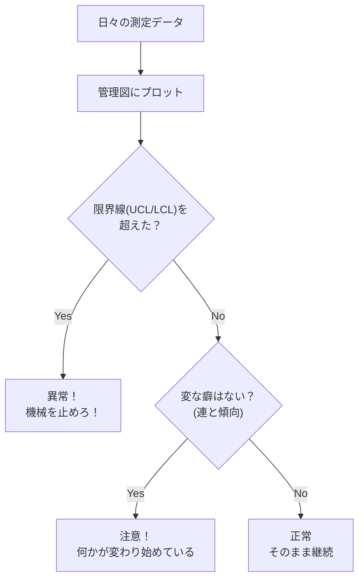

## この知識はいつ使うの？

*   **製造ラインの監視**: 製品の寸法が規格内に収まっているか、機械の調子が悪くなっていないかを日々チェックしたいとき。
*   **ソフトウェア監視**: サーバーのレスポンスタイムやエラー率を監視し、異常なスパイクが起きたらアラートを出したいとき。
*   **納品可否の判断**: 作った製品が顧客の要求スペックを満たしているか、統計的に保証したいとき。

## 管理図 (Control Chart) の仕組み

「偶然のばらつき」と「異常なばらつき」を見分けるためのグラフです。
3本の線（中心線CL、上方管理限界UCL、下方管理限界LCL）を引き、データがこの線の外に出たら「異常発生！」とみなします。



### 代表的な管理図の種類

| 種類 | 監視するもの | 使うデータの型 |
| :--- | :--- | :--- |
| **Xbar-R 管理図** | 平均値($\bar{X}$) と ばらつき($R$) | 連続値（長さ、重さなど） |
| **p 管理図** | 不良率 ($p$) | 計数値（〇×判定） |
| **c 管理図** | 欠点数 ($c$) | 計数値（傷の数など） |

## 工程能力指数 (Cp, Cpk)

「今の実力で、規格通りの製品をどれくらい余裕を持って作れるか？」を示すスコアです。

*   **Cp**: ばらつきの小ささ（精度）。$Cp > 1.33$ なら優秀。
*   **Cpk**: 平均値のズレも考慮した実質的な実力。

$$ Cp = \frac{\text{規格の幅}}{6 \times \text{標準偏差}} $$

「規格の幅の中に、標準偏差データが6個分（$\pm 3\sigma$）スッポリ入るか？」を見ています。

## Pythonでの実装：Xbar-R管理図のシミュレーション

データが管理限界を超えた瞬間を検知します。

```python
import numpy as np
import matplotlib.pyplot as plt

# 正常なデータ (平均10, 標準偏差1)
np.random.seed(42)
data_normal = np.random.normal(10, 1, 20)

# 異常なデータ (平均がずれた！12になった)
data_abnormal = np.random.normal(12, 1, 10)

data = np.concatenate([data_normal, data_abnormal])

# 管理限界線の計算 (簡易的に mean ± 3sigma)
mean = np.mean(data[:20]) # 正常期間で基準を作る
std = np.std(data[:20])
ucl = mean + 3 * std
lcl = mean - 3 * std
cl = mean

plt.figure(figsize=(10, 5))
plt.plot(data, 'o-', label='Data')
plt.axhline(ucl, color='red', linestyle='--', label='UCL (+3σ)')
plt.axhline(lcl, color='red', linestyle='--', label='LCL (-3σ)')
plt.axhline(cl, color='green', label='CL (Mean)')

# 異常検知
outliers = np.where((data > ucl) | (data < lcl))[0]
plt.scatter(outliers, data[outliers], color='red', s=100, zorder=5)

plt.title("X-bar Control Chart Simulation")
plt.legend()
plt.show()
```

20番目以降で平均値がズレたため、赤い点線（UCL）を超える点が出てきます。これで異常に気づけます。

## Rでの実装：qccパッケージ

Rには品質管理専用の優秀なパッケージ `qcc` があります。

```r
library(qcc)

# ピストンリングの直径データ (pistonrings)
data(pistonrings)
diameter <- pistonrings$diameter

# Xbar-R管理図を作成
# 最初の25グループを基準(calibration)とする
q <- qcc(diameter[1:25,], type="xbar", newdata=diameter[26:40,])

plot(q)
```

自動でUCL/LCLを計算し、さらに「連続して同じ側にある（連）」などのJISルールに基づいた異常判定も色付けしてくれます。

## まとめ

*   **管理図**は、「放っておいていいばらつき（偶然）」と「対処すべきばらつき（異常）」を分けるツール。
*   **$\pm 3\sigma$** (99.7%) の範囲を管理限界にするのが世界標準（シューハート管理図）。
*   **Cp/Cpk** は工程の「通信簿」。1.33を超えれば合格、1.0を切ると不良品多発の危機。
