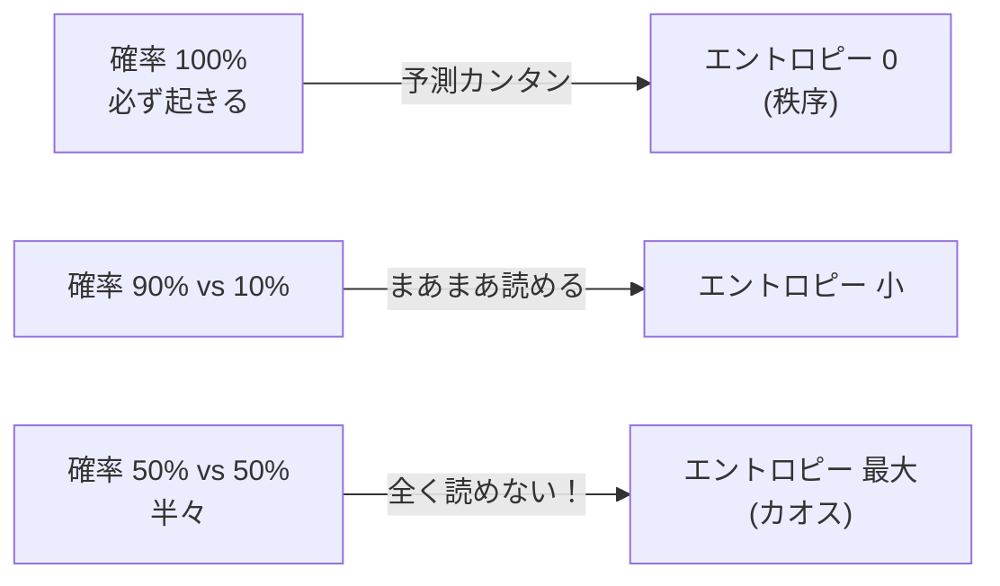

## この知識はいつ使うの？

*   **決定木 (Decision Tree)**: どの質問（特徴量）でデータを分ければ、一番きれいに分類できるか（情報利得）を計算するとき。
*   **機械学習の学習**: モデルの予測分布と真の分布の「ズレ」を最小化したいとき（クロスエントロピー誤差）。
*   **モデル選択**: AICの基礎理論として。

## 情報量＝驚きの大きさ

「明日、太陽が昇る」と言われても、「ふーん（情報量ゼロ）」ですが、「明日、宇宙人が来る」と言われたら「ええっ！？（情報量大）」となります。
**確率は低いほど、起きた時の情報量は大きい**と定義します。

$$ I(x) = - \log_2 P(x) $$

## エントロピー (Entropy)

「平均的にどれくらい驚くか？」つまり「先が読めない度合い（乱雑さ）」のことです。
確率分布 $P$ が一様（どれが起きるかわからない）なほどエントロピーは最大になります。



## KL情報量 (Kullback-Leibler Divergence)

2つの確率分布 $P$（真の分布）と $Q$（モデルの予測分布）が**どれくらい似ていないか（距離のようなもの）**を測る指標です。
機械学習では、これを最小にするように学習します。

$$ D_{KL}(P || Q) = \sum P(x) \log \frac{P(x)}{Q(x)} $$

*   $P=Q$ なら 0。
*   似ていないほど大きな値になる。

## Pythonでの実装：エントロピーとジニ係数

決定木の分岐基準に使われる「エントロピー」と「ジニ係数」を計算して比較します。確率 $p$ が 0.5 のとき（一番混ざっているとき）に最大になることを確認します。

```python
import numpy as np
import matplotlib.pyplot as plt

# 確率 p (クラス1である確率)
p = np.linspace(0.01, 0.99, 100)

# エントロピー: -p log p - (1-p) log (1-p)
entropy = -p * np.log2(p) - (1-p) * np.log2(1-p)

# ジニ不純度: 1 - (p^2 + (1-p)^2)
gini = 1 - (p**2 + (1-p)**2)

# スケール調整してプロット比較
plt.figure(figsize=(8, 5))
plt.plot(p, entropy, label='Entropy (max=1.0)', color='blue')
plt.plot(p, gini, label='Gini Impurity (max=0.5)', color='green', linestyle='--')
plt.xlabel("Probability p")
plt.ylabel("Inpurity")
plt.title("Entropy vs Gini Impurity")
plt.legend()
plt.grid(True)
plt.show()
```

どちらも $p=0.5$ で山なりになります。データの純度（混ざり具合）を測る指標として似た性質を持っています。

## Rでの実装：KL情報量の計算

2つの正規分布（$P$と$Q$）のズレを計算してみます。

```r
# KL情報量を数値積分で計算する関数
kl_divergence <- function(mu1, sigma1, mu2, sigma2) {
  f <- function(x) {
    p <- dnorm(x, mu1, sigma1)
    q <- dnorm(x, mu2, sigma2)
    return(p * log(p / q))
  }
  # -Inf から Inf まで積分
  integrate(f, -Inf, Inf)$value
}

# P: N(0, 1), Q: N(1, 1) -> 少しズレてる
kl1 <- kl_divergence(0, 1, 1, 1)

# P: N(0, 1), Q: N(0, 1) -> 同じ
kl2 <- kl_divergence(0, 1, 0, 1)

cat(sprintf("D_KL(N(0,1) || N(1,1)) = %.4f\n", kl1))
cat(sprintf("D_KL(N(0,1) || N(0,1)) = %.4f\n", kl2))
```

分布が重なっていれば0になり、平均がずれると値が大きくなります。

## まとめ

*   **情報量**は「珍しさ」の尺度。
*   **エントロピー**は「わからなさ（乱雑さ）」の尺度。データ圧縮や決定木で使われる。
*   **KL情報量**は分布間の「距離（似てなさ）」。機械学習の損失関数（クロスエントロピー）の正体はこれ。
