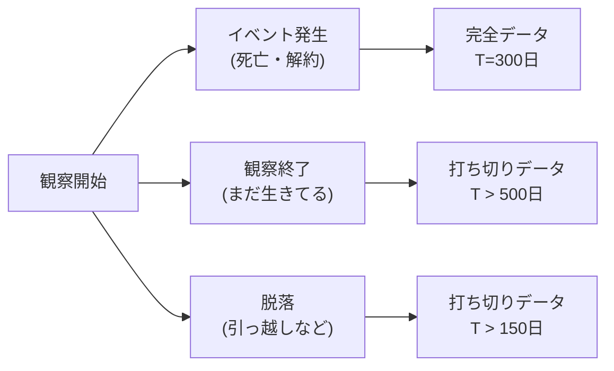

## この知識はいつ使うの？

*   **医療**: 手術後、患者さんが「何年生きられるか（生存率）」を推定したいとき。
*   **マーケティング**: ユーザーがサービスを「解約（チャーン）するまでの期間」を分析したいとき。
*   **アンケート**: 「年収」の回答欄が空白のデータがたくさんあるが、捨てずに分析したいとき。

## 生存時間解析 (Survival Analysis)

「イベント（死亡、故障、解約など）が起きるまでの時間 $T$」を扱う特殊な統計学です。

### 打ち切り (Censoring) 問題
普通の平均値が使えない最大の理由は「打ち切り」があるからです。
「観察期間終了まで生きていた」というデータは、「生存時間 $= 1000$日」ではなく「少なくとも1000日以上（$1000+$）」という情報です。これを正しく扱う手法が必要です。



### カプラン・マイヤー推定法
「生存率曲線」を描くデファクトスタンダードです。階段状のグラフになります。

## 欠測データ解析 (Missing Data)

データの一部が欠けているとき、どうしますか？「とりあえず平均値で埋める」は危険かもしれません。

| 欠測メカニズム | 名前 | 説明 | 対処法 |
| :--- | :--- | :--- | :--- |
| **MCAR** (完全無作為) | Missing Completely At Random | サイコロを振って消したようにランダム。 | そのまま削除しても偏らない（OK）。 |
| **MAR** (無作為) | Missing At Random | 他の変数（性別など）によってはランダム。「女性は体重を書かない傾向がある」など。 | **多重代入法**などで補正可能。 |
| **MNAR** (無作為でない) | Missing Not At Random | 「年収が高い人ほど年収を書かない」など、隠れた値そのものが欠測理由。 | **対処困難**。専門的なモデリングが必要。 |

## Pythonでの実装：カプラン・マイヤー曲線

`lifelines` ライブラリを使えば、生存曲線を一発で描けます。

```python
# pip install lifelines
from lifelines import KaplanMeierFitter
import matplotlib.pyplot as plt
import pandas as pd

# サンプルデータ
# T: 期間, E: イベント発生(1)か打ち切り(0)か
data = pd.DataFrame({
    'T': [5, 6, 6, 2.5, 4, 4],
    'E': [1, 0, 0, 1, 1, 1],
    'group': ['A', 'A', 'A', 'B', 'B', 'B']
})

kmf = KaplanMeierFitter()

# グループAの生存曲線
kmf.fit(data[data['group']=='A']['T'], data[data['group']=='A']['E'], label='Group A')
ax = kmf.plot_survival_function()

# グループBの生存曲線
kmf.fit(data[data['group']=='B']['T'], data[data['group']=='B']['E'], label='Group B')
kmf.plot_survival_function(ax=ax)

plt.title("Kaplan-Meier Survival Curve")
plt.ylabel("Survival Probability")
plt.show()
```

## Rでの実装：欠測データの可視化

`VIM` パッケージを使うと、どこに欠測が集中しているか（パターン）を視覚的にチェックできます。

```r
library(VIM)
data(sleep, package="VIM") # 哺乳類の睡眠データ

# 欠測パターンの可視化
# 左側: 変数ごとの欠測率
# 右側: 欠測の組み合わせ（DreamとNonDが同時に欠測しやすい、など）
aggr(sleep, prop=FALSE, numbers=TRUE)

# マトリックスプロット
# 特定の値（例えば短い寿命）のときに欠測しやすいか？などをチェック
matrixplot(sleep)
```

## まとめ

*   時間のデータには**生存時間解析**。打ち切りデータを捨てずに活用できる。平均寿命より**生存曲線（中央値）**を見よ。
*   欠測データには**メカニズム**がある。「なぜ空白なのか？」を考えずに削除したり埋めたりすると、分析結果が歪む（バイアス）。
*   MARなら**多重代入法 (MICE)** で救える。
