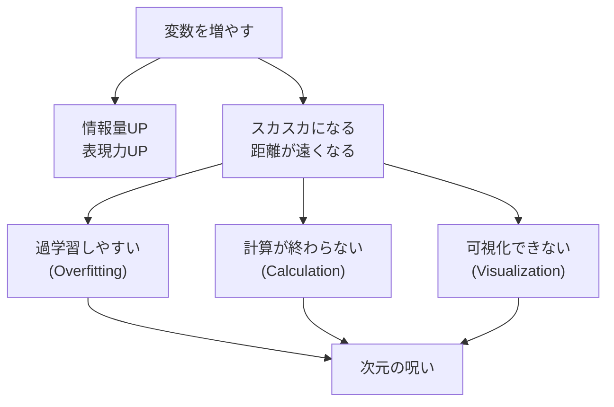

## この知識はいつ使うの？

*   **ゲノム解析**: 数万個の遺伝子データから、病気に関係ある数個を見つけたいとき（$p \gg n$ 問題）。
*   **画像認識**: 数百万ピクセルの画像データから、意味のある特徴を抽出したいとき。
*   **推薦システム**: 何百万もの商品とユーザーの組み合わせから、好みを予測したいとき。

## 次元の呪い (Curse of Dimensionality)

変数の数（次元）が増えると、空間がスカスカになり、データの「距離」が無意味になったり、計算量が爆発したりする現象です。



### 小数点以下の魔法：スパース性
高次元空間では、ほとんどの場所が「空っぽ」です。これを逆手に取って、「重要な変数はごく一部だけだ（スパース性）」と仮定することで、呪いを解くことができます（Lasso回帰など）。

## 戦略マップ：多すぎる変数をどうする？

| アプローチ | 手法名 | イメージ | メリット | デメリット |
| :--- | :--- | :--- | :--- | :--- |
| **特徴量選択** | ステップワイズ法<br>Lasso回帰 | ゴミを捨てる | 解釈しやすい（「これとこれが大事」と言える）。 | 捨てた変数に含まれる情報を失う。 |
| **特徴量抽出** | 主成分分析 (PCA)<br>オートエンコーダ | 混ぜて圧縮する | 情報をなるべく残せる。可視化できる。 | 混ぜた変数の意味がわからなくなる（解釈性ダウン）。 |
| **正則化** | リッジ回帰 (L2)<br>Elastic Net | 暴れるのを抑える | 係数を小さくして過学習を防ぐ。安定する。 | 変数は減らない（係数が0になりにくい）。 |

## Pythonでの実装：正則化回帰の比較

変数が多すぎる（100個）のにデータが少ない（20個）状況で、普通に回帰すると過学習してしまいます。LassoとRidgeでどう変わるか見ます。

```python
import numpy as np
import matplotlib.pyplot as plt
from sklearn.linear_model import LinearRegression, Lasso, Ridge
from sklearn.pipeline import make_pipeline
from sklearn.preprocessing import StandardScaler

# データ生成 (p=100, n=20)
np.random.seed(42)
X = np.random.randn(20, 100)
# 本当に効いている変数は最初の3つだけ
true_coef = np.zeros(100)
true_coef[:3] = [10, -5, 2]
y = X @ true_coef + np.random.randn(20)

# 1. 普通の線形回帰 (あてずっぽうにフィットしてしまう)
lr = LinearRegression().fit(X, y)

# 2. Lasso (L1正則化: 不要な変数を0にする)
lasso = Lasso(alpha=0.1).fit(X, y)

# 3. Ridge (L2正則化: 係数を小さく抑える)
ridge = Ridge(alpha=0.1).fit(X, y)

# 係数のプロット
plt.figure(figsize=(10, 5))
plt.plot(true_coef, 'k-', label='True Coef', linewidth=2)
plt.plot(lr.coef_, 'o', label='Linear (Overfit)', alpha=0.3)
plt.plot(lasso.coef_, 'x', label='Lasso (Sparse)', markeredgewidth=2)
plt.plot(ridge.coef_, '^', label='Ridge (Shrink)', alpha=0.5)
plt.legend()
plt.title("Comparison of Coefficients in High-Dimensional Data")
plt.show()
```

グラフを見ると、Lasso（×印）だけが、本当に効果のある最初の3つの変数付近以外を「ゼロ」にしています。これが**変数選択**の効果です。

## まとめ

*   次元が増えると、直感に反する現象（呪い）が起きる。安易に変数を増やさない。
*   **特徴量選択（Lasso）** か **特徴量抽出（PCA）** で次元を減らすのが基本戦略。
*   $p \gg n$ （変数がデータ数より多い）状況では、普通の回帰分析は不能。正則化が必須。
