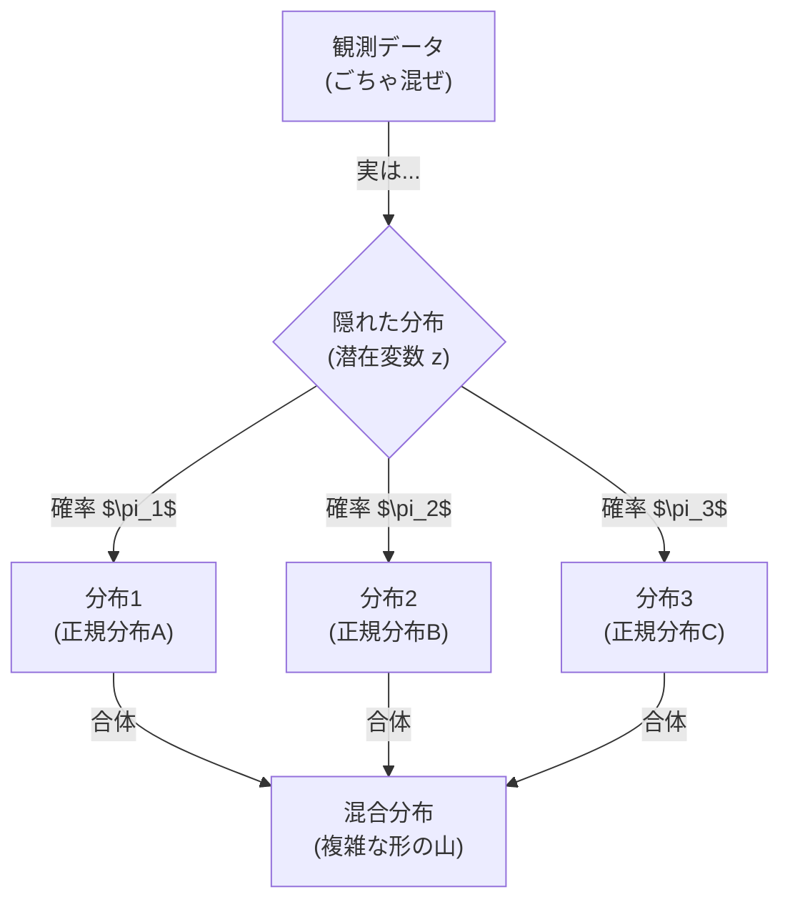

## この知識はいつ使うの？

*   **顧客セグメンテーション**: 購入履歴データから、「安さ重視層」「品質重視層」のような隠れた客層を自動分類したいとき。
*   **画像の色分割**: 写真のピクセルを、「空の色」「森の色」「地面の色」のように似た色ごとの分布に分けたいとき。
*   **異常検知**: 正常なデータの分布（複数のパターンの塊）から外れたデータを検知したいとき。

## 混合分布モデル (Mixture Model)

「データは1つの分布から出ている」のではなく、「**複数のサイコロ（分布）を使い分けて**出てきた」と考えます。

*   普通の正規分布モデル：全員が同じ山から生まれた。
*   **混合ガウスモデル (GMM)**：男性の山と、女性の山が混ざっている（山が2つある）。



## EMアルゴリズム：鶏が先か卵が先か

GMMを解くには、「どの山に属するか（クラス所属確率）」と「山の形（平均・分散）」の両方を決めないといけませんが、片方が決まらないともう片方も決まりません。
そこで、**とりあえず交互に更新して少しずつ正解に近づける**のがEMアルゴリズムです。

1.  **Eステップ (Expectation)**: 今のパラメータを使って、「どの山っぽいか」を予想する（ラベル付け）。
2.  **Mステップ (Maximization)**: 予想したラベルに基づいて、「山の形（平均・分散）」を更新する。

これを収束するまで繰り返します。K-means法の確率版とも言えます。

## Pythonでの実装：GMMによるクラスタリング

2つの山が重なったデータを生成し、GMMで分離してみます。

```python
import numpy as np
import matplotlib.pyplot as plt
from sklearn.mixture import GaussianMixture

# データの生成 (2つの山の混合)
np.random.seed(0)
shifted_gaussian = np.random.randn(200, 2) + np.array([3, 3])
standard_gaussian = np.random.randn(200, 2)
X = np.concatenate([shifted_gaussian, standard_gaussian])

# GMMモデルの学習 (クラスタ数=2)
gmm = GaussianMixture(n_components=2, random_state=0)
gmm.fit(X)
labels = gmm.predict(X)

# 可視化
plt.figure(figsize=(6, 6))
plt.scatter(X[:, 0], X[:, 1], c=labels, s=40, cmap='viridis')
plt.title("Gaussian Mixture Model Clustering")
plt.xlabel("Feature 1")
plt.ylabel("Feature 2")
plt.show()

# 推定されたパラメータの確認
print("推定された平均:\n", gmm.means_)
# [0,0]付近と[3,3]付近になるはず
```

K-means法と違って、丸くないデータ（楕円形など）も柔軟に捉えることができます。

## Rでの実装：Mclustパッケージ

Rの `mclust` パッケージは、最適なクラスター数をBICで自動選択してくれる便利な機能があります。

```r
library(mclust)

data(faithful) # イエローストーンの間欠泉データ（噴出時間と待ち時間）

# GMMによるクラスタリング（モデル選択も自動）
fit <- Mclust(faithful)

summary(fit)
# 最適なG(成分数)が表示される

plot(fit, what = "classification")
```

間欠泉のデータはきれいに2つのクラスター（短い噴出＆短い待ち時間 vs 長い噴出＆長い待ち時間）に分かれることが知られています。

## まとめ

*   データ分布が複雑なら、**「正規分布を足し合わせる（混合分布）」**ことで表現できる。
*   **GMM** は、K-means法よりも柔軟なクラスタリング手法（確率的な割り当てができる）。
*   パラメータ推定には **EMアルゴリズム**（期待値ステップと最大化ステップの繰り返し）が使われる。
