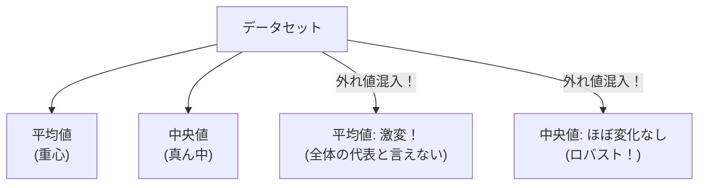

## この知識はいつ使うの？

*   **年収データの分析**: ビル・ゲイツが1人混じっても、一般庶民の感覚に近い「平均的な年収」を知りたいとき。
*   **センサーデータの処理**: たまにノイズで異常な値が飛ぶが、全体としてのトレンドラインを引きたいとき。
*   **金融データ**: ブラックマンデーのような極端な暴落が含まれていても、壊れないリスクモデルを作りたいとき。

## 平均値の弱点

平均値（最小二乗法）は、外れ値に弱すぎるという致命的な弱点があります。
シーソーの原理で、遠く離れた点（外れ値）の影響力が莫大になるからです。



## ロバストな手法たち

「外れ値を無視する」か、「影響力を弱める（重みを下げる）」アプローチがあります。

| 手法 | アイデア | 特徴 |
| :--- | :--- | :--- |
| **中央値 (Median)** | 順に並べて真ん中を取る。 | 最も有名で強力。ただし数学的な扱い（微分など）が面倒。 |
| **トリム平均** | 上位・下位 5% を捨ててから平均する。 | フィギュアスケートの採点などで採用。バランスが良い。 |
| **M推定 (Huber損失)** | 誤差が大きいデータのペナルティを減らす。 | 機械学習の回帰でよく使われる。外れ値の影響を線形に抑える。 |
| **LAD回帰** | 二乗誤差ではなく、絶対値誤差を最小化する。 | 中央値回帰とも呼ばれる。ロバストだが計算が遅い。 |

## Pythonでの実装：Huber回帰

外れ値があるデータに対して、普通の線形回帰（LinearRegression）とロバストなHuber回帰を比較します。

```python
import numpy as np
import matplotlib.pyplot as plt
from sklearn.linear_model import LinearRegression, HuberRegressor

# データ生成 (直線 + ノイズ)
np.random.seed(42)
X = np.linspace(0, 10, 20).reshape(-1, 1)
y = 2 * X.ravel() + 1 + np.random.normal(0, 1, 20)

# 外れ値を入れる (最後の2点を極端な値にする)
y[18] = 50
y[19] = -20

# 1. 普通の回帰 (Linear Regression)
lr = LinearRegression().fit(X, y)

# 2. Huber回帰 (Robust)
huber = HuberRegressor().fit(X, y)

# プロット
plt.scatter(X, y, color='black', label='Data (Choice outliers)')
plt.plot(X, lr.predict(X), color='red', linestyle='--', label='Linear (Affected)')
plt.plot(X, huber.predict(X), color='green', linewidth=2, label='Huber (Robust)')

plt.legend()
plt.title("Linear vs Huber Regression with Outliers")
plt.show()
```

赤い実線（線形回帰）は外れ値に引っ張られて傾きがおかしくなりますが、緑の線（Huber回帰）はメインのトレンドを正しく捉え続けます。

## Rでの実装：ロバスト回帰 (rlm)

Rの `MASS` パッケージにある `rlm` (Robust Linear Model) を使います。

```r
library(MASS)

# stacklossデータセット (外れ値を含むことで有名)
data(stackloss)

# 普通の回帰 (OLS)
ols_fit <- lm(stack.loss ~ ., data = stackloss)

# ロバスト回帰 (M推定)
rlm_fit <- rlm(stack.loss ~ ., data = stackloss)

summary(rlm_fit)

# ウェイトの確認（外れ値の重みが下げられているか？）
# 小さい値になっているデータが外れ値とみなされたもの
print(rlm_fit$w)
```

## まとめ

*   世の中のデータは正規分布ばかりではない。外れ値は必ずある。
*   平均値だけ見ていると騙される。**中央値**や**ヒストグラム**を見る癖をつける。
*   モデルを作る際は、外れ値に強い**ロバスト回帰（Huber損失など）**の選択肢を持っておく。
