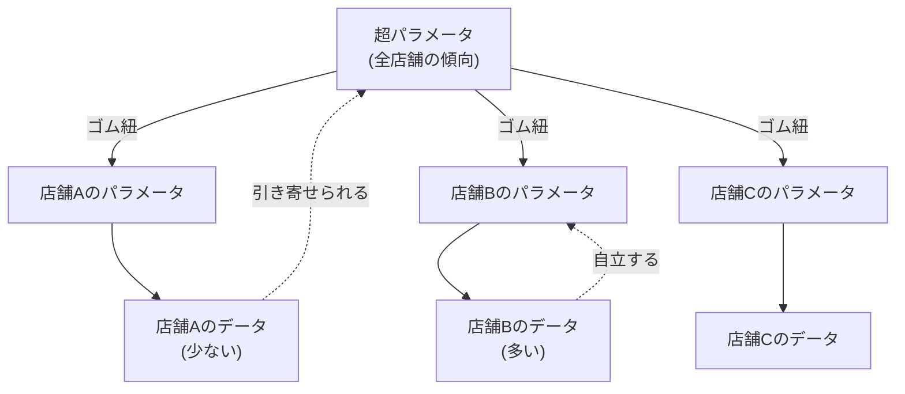

## この知識はいつ使うの？

*   **店舗ごとの売上分析**: 「オープンしたての店舗」はデータが少なくて予測が不安定。そこで「全店舗の平均的な傾向」を参考にして補正したいとき。
*   **個人別マーケティング**: ユーザーごとの反応率を知りたいが、クリック数が数回しかないユーザーが大量にいるとき。
*   **教育評価**: 生徒（レベル1）がクラス（レベル2）に属し、クラスが学校（レベル3）に属するような入れ子構造のデータを分析するとき。

## 階層モデルの直感的イメージ

「アヒルのおもちゃ」を想像してください。

1.  **プーリングなし（個別推定）**: 各アヒルがバラバラに動く（データが少ないと暴れる）。
2.  **完全プーリング（全体平均）**: 全員を一縛りにして同じ場所に置く（個性が死ぬ）。
3.  **階層ベイズ（部分プーリング）**: アヒルたちはゴム紐で「全体の中心」と繋がれている。
    *   データが多いアヒルは、紐を引っ張って自分の行きたい場所（個性）に行ける。
    *   データが少ないアヒルは、紐に引っ張られて中心（全体平均）に寄る。

**「情報の借用 (Borrowing Strength)」** がキーワードです。



## 固定効果と変量効果

| 名前 | 意味 | イメージ |
| :--- | :--- | :--- |
| **固定効果 (Fixed Effect)** | 全員に共通する効果。「全体平均」。 | どんな店舗でも、気温が上がれば売上は上がる。 |
| **変量効果 (Random Effect)** | グループごとの個体差。「ばらつき」。 | 店長の実力や立地によるベースの売上の違い。 |

これらを混ぜるので、**一般化線形混合モデル (GLMM)** とも呼ばれます。

## Pythonでの実装：PyMCによる階層モデル

複数のグループ（工場）があり、製造数が異なる状況で不良品率を推定します。

```python
import pymc as pm
import numpy as np

# データ生成（工場ごとの不良品率）
n_factories = 5
n_products = np.array([10, 10, 100, 100, 1000]) # データ数に差がある
true_rates = np.array([0.1, 0.4, 0.1, 0.1, 0.1])
failures = np.random.binomial(n_products, true_rates)

with pm.Model() as hierarchical_model:
    # 超パラメータ (全体の傾向)
    mu = pm.Normal('mu', 0, 10)
    sigma = pm.HalfNormal('sigma', 10)
    
    # グループごとのパラメータ (個別の傾向)
    # 全体の分布 N(mu, sigma) から生成されると仮定
    theta_raw = pm.Normal('theta_raw', mu, sigma, shape=n_factories)
    p = pm.Deterministic('p', pm.math.sigmoid(theta_raw))
    
    # 尤度
    y = pm.Binomial('y', n=n_products, p=p, observed=failures)
    
    # 推定
    trace = pm.sample(1000, chains=2)

pm.plot_forest(trace, var_names=['p'])
```

結果を見ると、データ数（`n_products`）が少ない工場（1, 2番目）の推定値の信頼区間は広くなりますが、極端な値（0%や100%）にはならず、全体平均の方へ「縮小（Shrinkage）」されているはずです。

## Rでの実装：lme4パッケージ

Rでは `lme4` や `brms` パッケージが非常に強力です。

```r
library(lme4)

# sleepstudyデータセット (被験者ごとの反応時間の変化)
# Reaction ~ Days (日数経過で反応が遅くなるか？)
# (1 + Days | Subject): 被験者ごとに「切片」も「傾き」も違うことを許容する

model <- lmer(Reaction ~ Days + (1 + Days | Subject), data = sleepstudy)

summary(model)

# 個人ごとの推定値 (BLUP)
coef(model)$Subject
```

## まとめ

*   **階層ベイズ**は、データが少ないグループの推定精度を、全体のデータを使って底上げする技術。
*   「個性を認めつつ、行き過ぎは是正する」という、非常にバランスの良い推定ができる（縮約推定）。
*   現実のデータはほとんどが**階層構造**（店・人・時間など）をしているため、実務での適用範囲は非常に広い。
