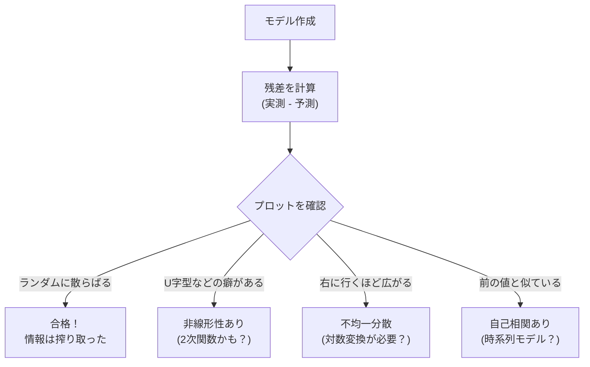

## この知識はいつ使うの？

*   **モデルの健康診断**: 回帰分析をしてみたが、なんとなく予測が外れる。前提条件（等分散性など）が満たされているか調べたいとき。
*   **AIコンペ (Kaggle)**: 手元のデータでスコアが良くても、提出すると順位が低い（過学習）。Leaderboardのスコアを正確に見積もりたいとき。
*   **信頼性の保証**: 「このモデルは現場投入しても大丈夫」というエビデンスを出したいとき。

## モデル診断：残差を見る

良いモデルを作ったなら、予測とのズレである**「残差 (Residuals)」**はただの雑音（ホワイトノイズ）になっているはずです。
もし残差に「パターン」が残っていたら、モデルが何か重要な情報を見落としています。



### Q-Qプロットによる正規性の確認
残差が「正規分布」に従っているかを確認するグラフです。点が一直線上に並べばOKです。

## 交差検証 (Cross Validation)

手持ちのデータを「学習用」と「テスト用」に分けて評価しますが、分け方によって運が生じます。
**K分割交差検証 (K-Fold CV)** は、データをK個にわけ、役割をローテーションさせて全員が1回ずつテスト役をやる方法です。

| 手法 | 説明 | メリット | デメリット |
| :--- | :--- | :--- | :--- |
| **Hold-out法** | 単に 8:2 に分ける。 | 計算が速い。 | 分け方の運に左右される。 |
| **K-Fold CV** | K回ローテーションして平均を取る。 | **信頼性が高い**。データ全体を有効活用できる。 | 計算時間がK倍かかる。 |
| **LOOCV** | 1個だけテストにする（究極のK-Fold）。 | データが極端に少ないときに有効。 | 計算コストが最大。 |

## Pythonでの実装：K-Fold交差検証

`scikit-learn` でK-Foldを行い、モデルの汎化性能を評価します。

```python
from sklearn.model_selection import cross_val_score, KFold
from sklearn.linear_model import LinearRegression
from sklearn import datasets
import numpy as np

# データ準備 (Diabetes dataset)
X, y = datasets.load_diabetes(return_X_y=True)

model = LinearRegression()

# 5-Fold CVの設定
kf = KFold(n_splits=5, shuffle=True, random_state=42)

# 交差検証実行 (評価指標: Negative MSE)
scores = cross_val_score(model, X, y, cv=kf, scoring='neg_mean_squared_error')

# 見やすいようにRMSEに変換
rmse_scores = np.sqrt(-scores)

print(f"各FoldのRMSE: {rmse_scores}")
print(f"平均RMSE: {np.mean(rmse_scores):.3f} (± {np.std(rmse_scores):.3f})")
```

「平均RMSE: 53.5」のように、より確かな予測誤差を見積もることができます。

## Rでの実装：残差診断プロット

Rの `plot(lm_model)` は、4つの診断図を自動で出してくれます。これが非常に優秀です。

```r
# 回帰分析
model <- lm(mpg ~ wt + qsec, data = mtcars)

# 画面分割してプロット
par(mfrow=c(2, 2))
plot(model)
```

1.  **Residuals vs Fitted**: 非線形性のチェック（ぐにゃっとしてないか？）。
2.  **Normal Q-Q**: 正規性のチェック（直線に乗ってるか？）。
3.  **Scale-Location**: 等分散性のチェック（広がり方が均一か？）。
4.  **Residuals vs Leverage**: 外れ値・テコ比のチェック（影響力が強すぎる点はないか？）。

## まとめ

*   モデルを作ったら終わりではない。**残差**を見て、搾り取れていない情報がないか確認する（モデル診断）。
*   ホールドアウト法だけでは不安。**K分割交差検証**をして、スコアのばらつきまで確認するのがプロの作法。
*   「学習データでのスコア」と「テストデータでのスコア」の差が大きいときは**過学習**を疑う。
