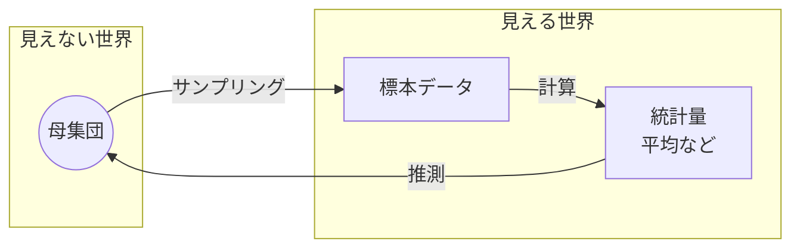
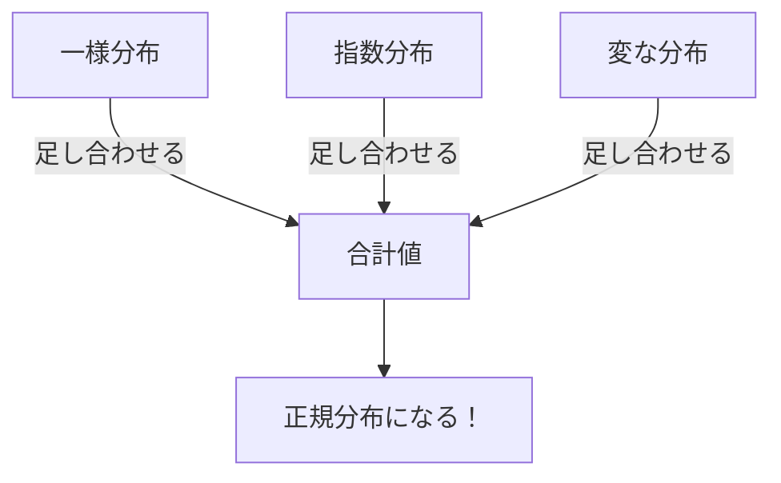

## この知識はいつ使うの？

*   **アンケート分析**: 1000人の調査結果から、日本人全体の傾向を推測したいとき。
*   **品質管理**: 工場の製品をいくつか抜き取って検査し、ライン全体の品質を保証したいとき。
*   **A/Bテスト**: クリック率の差が「偶然」なのか「実力」なのか判断したいとき（基礎となる考え方）。

## 統計的推測の仕組み：全体像

統計学のゴールは「神のみぞ知る**母集団**」の性質を、手元の「**標本**」から言い当てることです。



この「推測」を支えるのが、次の2つの強力な定理です。

## 1. 2つの偉大な定理

| 定理名 | 一言でいうと？ | 何が嬉しいの？ |
| :--- | :--- | :--- |
| **大数の法則** | データが増えれば、平均値は**真の値**に近づく。 | 「データをたくさん集めれば、真実にたどり着ける」ことが保証される。 |
| **中心極限定理 (CLT)** | データが増えれば、平均値の分布は**正規分布**に近づく。 | 元のデータがどんな変な形でも、合計や平均さえとれば**正規分布として扱って計算してOK**になる。 |

### 中心極限定理のすごさ（イメージ）

元の分布が「サイコロ」でも「偏ったコイン」でも、何度も足し合わせると、その合計値のヒストグラムはきれいな釣鐘型（正規分布）になります。



## 2. 標本分布の性質

「標本平均 $\bar{X}$」もまた、確率変数です（サンプリングするたびに値が変わるから）。
この「統計量の分布」のことを**標本分布**と呼びます。

*   期待値 $E[\bar{X}] = \mu$ （母平均と同じ）
*   分散 $V[\bar{X}] = \frac{\sigma^2}{n}$ （母分散の $1/n$ になる！）

**ポイント**: サンプルサイズ $n$ が大きくなると、分散が小さくなり、平均値の周りにギュッと集まるようになります。だから推定の精度が上がるのです。

## Pythonでの実験：中心極限定理を見てみよう

「指数分布（右肩下がりの分布）」からデータを取って、その平均値の分布を描いてみます。
元の分布は正規分布ではありませんが、平均をとると正規分布に近づくでしょうか？

```python
import numpy as np
import matplotlib.pyplot as plt

# 設定
N_samples = 10000  # シミュレーション回数
n = 30             # サンプルサイズ（これが増えると正規分布に近づく）

# 指数分布から n 個ずつデータを取って平均を計算 × N_samples回
means = [np.mean(np.random.exponential(scale=1.0, size=n)) for _ in range(N_samples)]

# ヒストグラムの描画
plt.figure(figsize=(8, 5))
plt.hist(means, bins=50, density=True, alpha=0.7, color='purple', label='Sample Means')

# 理論的な正規分布（平均1, 分散1/n）
x = np.linspace(0.4, 1.6, 100)
pdf = (1 / np.sqrt(2 * np.pi * (1/n))) * np.exp(- (x - 1)**2 / (2 * (1/n)))
plt.plot(x, pdf, 'r-', lw=2, label='Theoretical Normal Dist')

plt.title(f"Central Limit Theorem (n={n})")
plt.legend()
plt.show()
```

ヒストグラム（紫）が理論的な正規分布（赤線）ときれいに重なります。これが中心極限定理の威力です。

## Rでの実験：大数の法則

サンプルサイズ $n$ を増やしていくと、標本平均が徐々に真の平均（ここでは定数0）に収束していく様子を描きます。

```r
set.seed(123)
n_max <- 1000
x <- rnorm(n_max, mean=0, sd=1) # 標準正規分布から1000個生成

# 累積平均を計算 (n=1の平均, n=2までの平均, ...)
cumulative_means <- cumsum(x) / (1:n_max)

plot(cumulative_means, type="l", col="blue", lwd=2,
     ylim=c(-1, 1), xlab="Sample Size n", ylab="Sample Mean",
     main="Law of Large Numbers")
abline(h=0, col="red", lty=2) # 真の平均
```

$n$ が小さいときは暴れていますが、右に行くにつれて赤線（真の値）にピタリと吸い寄せられていくのがわかります。

## まとめ

*   **大数の法則**: 数こそ正義。データ数を増やせば真の平均に近づく。
*   **中心極限定理**: 足せば正規分布。この定理のおかげで、いろいろな検定や区間推定が可能になる。
*   どんなデータでも、とりあえず数が揃えば正規分布の道具が使えるようになる、という**統計学の免罪符**のような存在です。
