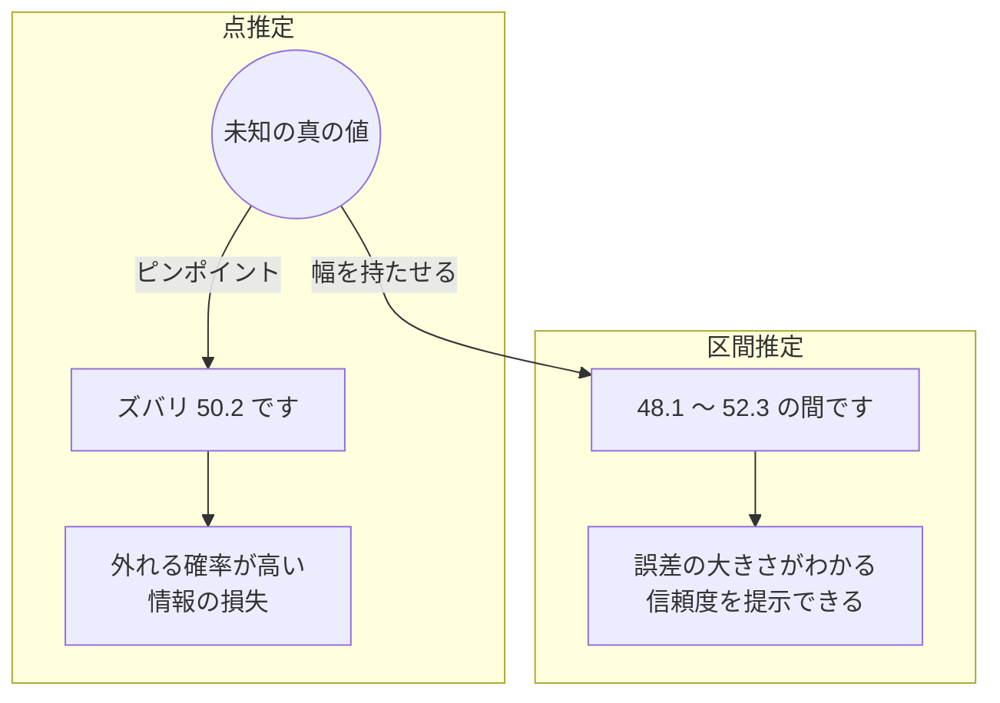
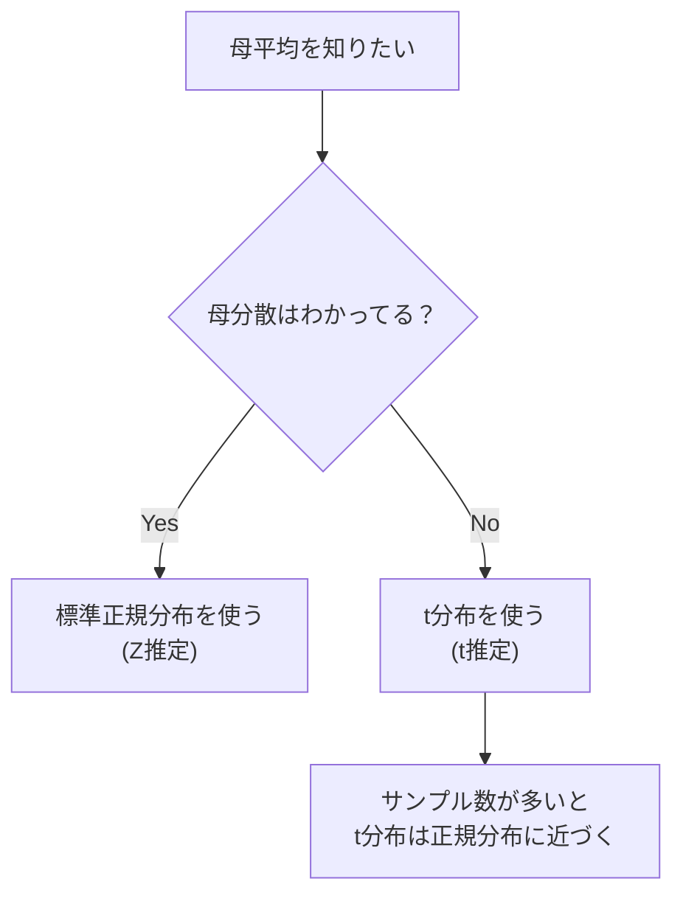

## この知識はいつ使うの？

*   **選挙速報**: 「A候補の得票率は40% ± 3% と推定されます」というあの一言の意味を知りたいとき。
*   **ビジネスの意思決定**: 「クリック率は 5%」という一点張りではなく、「最悪でも 4.2% はある」というリスク評価がしたいとき。
*   **機械学習**: モデルのパラメータ学習（最尤推定）の理論的背景として。

## 推定の2つのアプローチ

未知のパラメータ（母平均など）を推測する方法には、2つのスタイルがあります。



## 1. 点推定 (Point Estimation)

「値はズバリこれだ！」と一点を指定する方法です。

*   **不偏性**: 平均的に見れば的を射ているか？（偏りがないか）
*   **一致性**: データが増えれば真の値に近づくか？（大数の法則）

### 最尤法（さいゆうほう）
点推定の王様です。「**いま手元にあるデータが得られる確率が最大になるようなパラメータ**」を答えとします。

**イメージ**:
「池から魚を10匹釣ったら全部コイだった」
$\rightarrow$ 「この池にはフナしかいない」「半々でいる」などの仮説よりも、「この池はコイだらけ（コイ率100%）」と考えるのが一番自然（尤もらしい）。

## 2. 区間推定 (Interval Estimation)

「95%の確率で、この範囲内に真の値があるような計算方法」です。
※ 正確には「この方法で100回区間を作れば、95回は真の値を含む」という意味（頻度論的解釈）。

| 推定する値 | 使う分布 | 条件 | 手法名 |
| :--- | :--- | :--- | :--- |
| **母平均** $\mu$ | **正規分布** ($Z$) | 母分散 $\sigma^2$ が既知 | $Z$推定 |
| **母平均** $\mu$ | **t分布** ($t$) | 母分散 $\sigma^2$ が未知（普通はこれ） | t推定 |
| **母比率** $p$ | **正規分布** ($Z$) | サンプル数が多いとき | 近似法 |
| **母分散** $\sigma^2$ | **カイ二乗分布** ($\chi^2$) | データが正規分布に従うとき | $\chi^2$推定 |

### フローチャート：母平均の区間推定手順



## Pythonでの実装：区間推定

有名な `tips` データセットを使って、「チップの平均額」の95%信頼区間を求めてみます。母分散は未知なので、**t分布**を使います。

```python
import pandas as pd
import numpy as np
from scipy import stats
import seaborn as sns

# データのロード
tips = sns.load_dataset('tips')['tip']

# 統計量の計算
n = len(tips)           # サンプルサイズ
m = np.mean(tips)       # 標本平均
s = np.std(tips, ddof=1) # 不偏標準偏差 (ddof=1)
dof = n - 1             # 自由度

# 95%信頼区間の計算 (alpha=0.05)
confidence = 0.95
alpha = 1 - confidence
ci = stats.t.interval(alpha=confidence, df=dof, loc=m, scale=s/np.sqrt(n))

print(f"平均チップ額: ${m:.2f}")
print(f"95%信頼区間: ${ci[0]:.2f} 〜 ${ci[1]:.2f}")
```

## Rでの実装：最尤推定

Rの `MASS` パッケージを使って、正規分布のパラメータ（平均と分散）を最尤推定してみます。

```r
library(MASS)

# データ生成
set.seed(123)
data <- rnorm(100, mean=10, sd=5)

# fitdistr関数で最尤推定
fit <- fitdistr(data, densfun="normal")

print(fit)
# meanとsdの推定値と、その標準誤差(カッコ内)が表示されます
```

## まとめ

*   **点推定**は使いやすいが、誤差がわからない。
*   **区間推定**は「幅（誤差）」を評価できるので、より科学的で誠実。
*   現実の問題では母分散はわからないので、**t分布**を使った区間推定が最も一般的。
