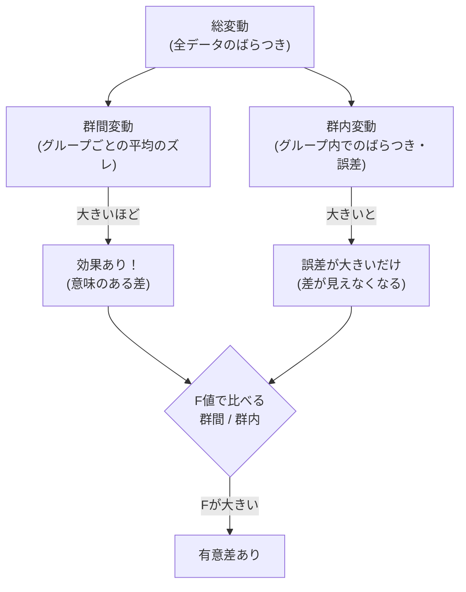

## この知識はいつ使うの？

*   **3種類以上の比較**: 「A案、B案、C案」のデザインで、クリック率に差があるか一気に調べたいとき。
*   **要因の特定**: 肥料の種類（要因1）と日当たり（要因2）が、植物の成長にどう効いているのかを切り分けたいとき（二元配置分散分析）。
*   **実験計画法**: 効率的に実験を行うための分析ベースとして。

## なぜt検定じゃダメなの？ (多重性の問題)

3つのグループ (A, B, C) があるとき、「A vs B」「B vs C」「C vs A」と3回t検定をやれば良さそうに見えます。
しかし、検定を繰り返すと「偶然エラー（第一種の過誤）」が出る確率がどんどん増えてしまいます。

*   1回の誤り率: 5%
*   3回繰り返した時の少なくとも1回誤る率: $1 - (0.95)^3 \approx 14.3\%$ （大きすぎる！）

そこで、**分散分析 (ANOVA)** で「全体として差があるか？」を一発で判定します。

## 分散分析の仕組み：ばらつき分解

「データ全体のばらつき」を、「グループ間の違いによるばらつき」と「偶然の誤差によるばらつき」に分解して比較します。



### F検定のイメージ

*   **F値** = (グループ間のズレの大きさ) / (グループ内の誤差の大きさ)
*   もしグループによる差がなければ、F値は 1 くらいになります。
*   F値が極端に大きければ（例えば 5 とか 10 とか）、「誤差にしてはグループ間のズレが大きすぎる＝差がある」と判断します。

## 分析パターンの分類

| 種類 | 要因の数 | データの対応 | 具体例 |
| :--- | :--- | :--- | :--- |
| **一元配置分散分析** | 1つ | 対応なし | クラスA, B, C のテスト平均点比較 |
| **二元配置分散分析** | 2つ | 対応なし | 「学習法(オン/オフ)」と「性別(男/女)」による成績差 |
| **反復測定分散分析** | 1つ以上 | **対応あり** | 同じ被験者に、薬A→薬B→薬Cと変えて血圧測定 |

## Pythonでの実装：一元配置分散分析

3つの異なる肥料を与えた植物の成長記録を比較します。

```python
import pandas as pd
from scipy import stats

# データ準備
# 肥料A, B, C で育てた植物の高さ(cm)
fertilizer_A = [20, 22, 19, 21, 20]
fertilizer_B = [25, 27, 26, 28, 25] # よく効いてそう
fertilizer_C = [21, 20, 19, 20, 22] # Aと変わらない？

# f_oneway関数でANOVA実行
f_stat, p_val = stats.f_oneway(fertilizer_A, fertilizer_B, fertilizer_C)

print(f"F値: {f_stat:.3f}")
print(f"p値: {p_val:.5f}")

if p_val < 0.05:
    print("結論: 少なくとも1つの肥料グループに平均の差がある")
```

## Rでの実装：二元配置分散分析

「サプリメントの種類(supp)」と「投与量(dose)」が歯の成長(len)に与える影響を調べます（ToothGrowthデータセット）。
また、2つの要因が絡み合う**交互作用**（例：量が多い時だけ種類Aが効く、など）もチェックします。

```r
data(ToothGrowth)
# doseをカテゴリカル変数に変換
ToothGrowth$dose <- as.factor(ToothGrowth$dose)

# 二元配置分散分析 (交互作用あり: *)
aov_model <- aov(len ~ supp * dose, data = ToothGrowth)

summary(aov_model)
```

## まとめ

*   **3群以上の比較**には、t検定ではなく**分散分析 (ANOVA)** を使う。
*   「ばらつき（群間変動）」と「ノイズ（群内変動）」の比率（F値）を見る。
*   ANOVAで「差がある」とわかったら、その後に「どれとどれが違うか」を調べるために**多重比較法**（Tukey法など）を行うのが定石。
