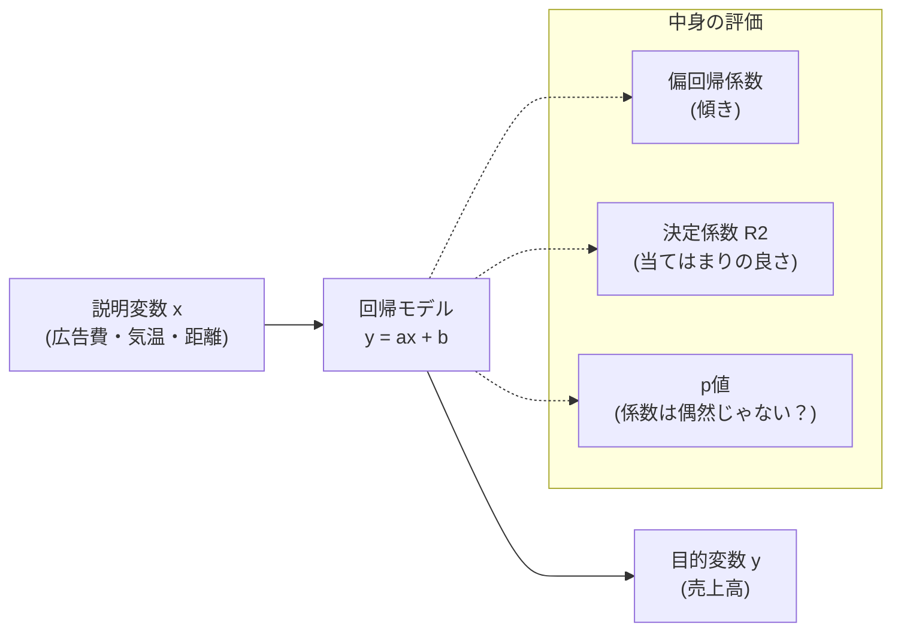

## この知識はいつ使うの？

*   **売上予測**: 「広告費を100万円増やしたら、売上はいくら伸びるか？」を係数として知りたいとき。
*   **要因分析**: 店の売上に効いているのは「駅からの距離」なのか「店内の広さ」なのか、影響度を比較したいとき。
*   **機械学習**: 線形回帰モデルは、最もシンプルかつ解釈しやすい予測モデルのベースラインとなる。

## 回帰分析のイメージ：点をつなぐ線

回帰分析とは、散らばったデータ点の間を貫く「もっとも当てはまりの良い直線（または平面）」を引くことです。

$$ y = \beta_0 + \beta_1 x_1 + \beta_2 x_2 + \dots + \epsilon $$

*   $y$: 目的変数（予測したいもの。売上など）
*   $x$: 説明変数（原因となるもの。広告費など）
*   $\beta$: 偏回帰係数（影響力の強さ。これを求めたい！）



## 単回帰 vs 重回帰

| 種類 | 式のイメージ | 説明 | 注意点 |
| :--- | :--- | :--- | :--- |
| **単回帰分析** | $y = ax + b$ | 説明変数が1つだけ。散布図に直線を引くイメージ。 | 現実には原因が1つということは稀。 |
| **重回帰分析** | $y = a_1 x_1 + a_2 x_2 + b$ | 説明変数が複数。要素ごとの影響力を分離できる。 | **多重共線性 (Multico)** に気をつける必要あり。 |

### ⚠️ マルチコ（多重共線性）の罠

重回帰分析で、相関係数が非常に高い変数同士（例：「気温」と「不快指数」）を一緒に説明変数に入れると、計算がおかしくなり、係数がめちゃくちゃな値になる現象です。
**「似たもの同士は片方だけ使う」**のが鉄則です。

## Pythonでの実装：重回帰分析

家賃の予測を想定してみましょう。「広さ」と「築年数」から家賃を予測します。
`scikit-learn` を使えば簡単です。

```python
import pandas as pd
from sklearn.linear_model import LinearRegression

# ダミーデータ
data = {
    'rent': [80000, 120000, 95000, 150000, 70000],
    'size': [25, 40, 30, 50, 20],   # 広さ(m2)
    'age':  [10, 5, 15, 2, 30]      # 築年数(年)
}
df = pd.DataFrame(data)

# 説明変数(X)と目的変数(y)
X = df[['size', 'age']]
y = df['rent']

# モデルの学習
model = LinearRegression()
model.fit(X, y)

print(f"切片: {model.intercept_:.0f}")
print(f"広さの係数: {model.coef_[0]:.0f} (1m2増えるとこれだけ家賃UP)")
print(f"築年数の係数: {model.coef_[1]:.0f} (1年古くなるとこれだけ家賃DOWN)")
```

## Rでの実装：詳細な統計量

`lm` 関数を使えば、p値や決定係数($R^2$)まで詳細なレポートが出せます。実務での分析にはこちらが便利です。

```r
# mtcarsデータセットを使用
# mpg(燃費) を wt(重さ) と hp(馬力) で説明する
model <- lm(mpg ~ wt + hp, data = mtcars)

summary(model)
```

出力結果で見るべきポイント：
1.  **Estimate**: 係数の値（プラスなら正の影響、マイナスなら負の影響）。
2.  **Pr(>|t|)**: p値。星マーク(**\***)がついていれば、「その変数は統計的に有意に効いている」という証拠。
3.  **Multiple R-squared**: 決定係数。1に近いほど予測精度の高いモデル。

## まとめ

*   まずは**散布図**を描いて関係を見る。
*   **重回帰分析**を使えば、「他の条件を一定にした場合の、その変数の純粋な影響力」がわかる（ceteris paribus）。
*   決定係数 $R^2$ だけで判断せず、変数の有意性（t検定）やマルチコ（VIF）もチェックするプロの視点を持とう。
