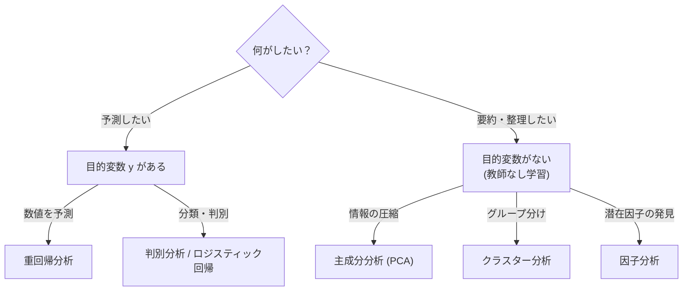

## この知識はいつ使うの？

*   **データの可視化**: 50個の質問項目があるアンケート結果を、2次元の地図（散布図）にして、「似ている人」のグループを見たいとき。
*   **データ前処理**: 機械学習にかける前に、変数が多すぎるので、情報のロスを最小限にして変数を減らしたい（次元削減）とき。
*   **総合指標の作成**: 国語・数学・英語の点数をまとめて「総合学力」という新しい指標を作りたいとき。

## 多変量解析の全体像

「変数がたくさんある ($x_1, x_2, \dots, x_p$)」ときにどう扱うかで手法が分かれます。



## 主成分分析 (PCA) の仕組み

PCAは、ごちゃごちゃしたデータを「もっとも情報量が多い（分散が大きい）方向」から見るカメラアングルを探す手法です。

1.  **第1主成分 (PC1)**: データが一番散らばっている方向。データの「総合力」を表すことが多い。
2.  **第2主成分 (PC2)**: PC1と直交する方向の中で、次に散らばっている方向。「特徴の違い」を表すことが多い。

| 用語 | 意味 | イメージ |
| :--- | :--- | :--- |
| **主成分得点** | 新しい軸での各データの座標 | 新しい偏差値 |
| **固有ベクトル** | 新しい軸が、元の変数のどの組み合わせか | 「国語x0.5 + 数学x0.5」のようなレシピ |
| **寄与率** | その主成分だけで元の情報の何%を説明できているか | 情報の圧縮率 |

## Pythonでの実装：IrisデータセットのPCA

有名なアヤメのデータ（4次元変数：がく片の長さ/幅、花弁の長さ/幅）を、PCAで2次元に圧縮して可視化します。4次元は見えませんが、2次元なら散布図が描けます。

```python
import matplotlib.pyplot as plt
from sklearn import datasets
from sklearn.decomposition import PCA
import pandas as pd

# データロード
iris = datasets.load_iris()
X = iris.data
y = iris.target

# PCA実行 (2次元に圧縮)
pca = PCA(n_components=2)
X_pca = pca.fit_transform(X)

# 結果のデータフレーム化
df_pca = pd.DataFrame(X_pca, columns=['PC1', 'PC2'])
df_pca['target'] = y

# 可視化
plt.figure(figsize=(8, 6))
colors = ['r', 'g', 'b']
for target, color in zip([0, 1, 2], colors):
    subset = df_pca[df_pca['target'] == target]
    plt.scatter(subset['PC1'], subset['PC2'], c=color, label=iris.target_names[target])

plt.xlabel(f"PC1 (寄与率: {pca.explained_variance_ratio_[0]:.2f})")
plt.ylabel(f"PC2 (寄与率: {pca.explained_variance_ratio_[1]:.2f})")
plt.legend()
plt.title("PCA of Iris Dataset")
plt.show()
```

結果を見ると、重なり合っていたデータがPC1軸できれいに分離できていることがわかります。

## Rでの実装：バイプロット

Rの `prcomp` 関数と `biplot` を使うと、データ点だけでなく「元の変数がどの方向に効いているか（矢印）」も同時に可視化できます。

```r
# mtcarsデータセットを使用
# 相関行列ベース(scale=TRUE)でPCAを実行
pca_result <- prcomp(mtcars, scale=TRUE)

# 寄与率の確認
summary(pca_result)

# バイプロットを描画
biplot(pca_result, scale=0, cex=0.7)
```

矢印の向きが近い変数同士（例えば `cyl` と `disp`）は相関が高く、逆向きの変数（`mpg` と `hp` など）は負の相関があることが視覚的にわかります。

## まとめ

*   **主成分分析 (PCA)** は、多次元データを「情報の損失を最小限にして」低次元に圧縮する。
*   次元を減らすことで、人間が理解できる図（2D/3D散布図）にしたり、機械学習の効率を上げたりできる。
*   どの軸が重要かは**寄与率**を確認し、累積寄与率が80%程度になるまでの主成分を採用するのが目安。
