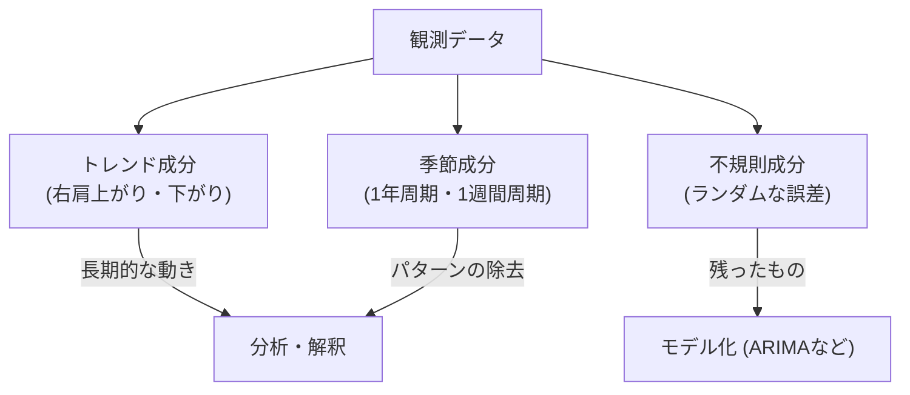

## この知識はいつ使うの？

*   **株価や売上の分析**: 「昨日の株価が高ければ、今日も高いだろう」というような、時間的な依存関係をモデル化したいとき。
*   **トレンドの発見**: データが右肩上がりなのか、季節性（夏に売れるなど）があるのかを分解して理解したいとき。
*   **将来予測**: 過去のパターンから来月や来年の数値を予測したいとき。

## 時系列データの構造：分解してみよう

時系列データは、たいてい3つの要素の足し合わせでできています。



この「トレンド」や「季節性」が含まれているままだと、統計的な扱かいが難しいです。そこで登場するのが**定常性**という概念です。

## 1. 定常性 (Stationarity)

「いつ切り取っても、データの確率的な性質（平均や分散）が変わらない」状態のことです。

*   **弱定常**: 平均と分散が一定で、共分散が時間差（ラグ）だけに依存する。
*   **非定常**: トレンドがあったり（平均が変わる）、振幅がどんどん大きくなったり（分散が変わる）する。

多くの時系列モデル（ARモデルなど）は、「データが定常であること」を前提にしています。
そのため、非定常なデータは**差分をとる（昨日の値との引き算をする）**などして、無理やり定常にしてから解析します。

## 2. 自己相関 (Autocorrelation)

「自分自身との相関」です。「1日前（ラグ1）の自分」と「今日の自分」はどれくらい似ているか？を表します。

| 指標 | 説明 | 何がわかる？ |
| :--- | :--- | :--- |
| **自己相関関数 (ACF)** | 時間差 $k$ での相関全て | 季節性の発見（12ヶ月ごとに相関が高いなど）。 |
| **偏自己相関関数 (PACF)** | 間の時間の影響を除いた、純粋な時間差 $k$ の相関 | ARモデルの次数 $p$ の決定に使う。 |

## Pythonでの実装：成分分解とコレログラム

`statsmodels` を使えば、時系列データの分解と、自己相関の可視化（コレログラム）が一瞬でできます。

```python
import pandas as pd
import numpy as np
import matplotlib.pyplot as plt
import statsmodels.api as sm

# サンプルデータ生成（トレンド + 季節性 + ノイズ）
np.random.seed(42)
dates = pd.date_range(start='2020-01-01', periods=100, freq='M')
trend = np.linspace(0, 10, 100)
seasonal = 5 * np.sin(2 * np.pi * np.arange(100) / 12)
noise = np.random.normal(0, 1, 100)
data = pd.Series(trend + seasonal + noise, index=dates)

# 1. 季節調整分解 (STL分解のようなもの)
res = sm.tsa.seasonal_decompose(data, model='additive')
res.plot()
plt.show()

# 2. 自己相関(ACF) と 偏自己相関(PACF) のプロット
fig, ax = plt.subplots(1, 2, figsize=(12, 4))
sm.graphics.tsa.plot_acf(data, lags=24, ax=ax[0])
sm.graphics.tsa.plot_pacf(data, lags=24, ax=ax[1])
plt.show()
```

コレログラム（ACF）を見ると、12ヶ月ごとの周期的な波（ピーク）が確認でき、季節性があることが視覚的にわかります。

## Rでの実装：自己相関の確認

Rでは `acf` 関数と `pacf` 関数が標準で用意されています。

```r
# AirPassengersデータセット（月ごとの航空会社乗客数）
data(AirPassengers)

par(mfrow=c(2,1))

# 自己相関プロット
acf(AirPassengers, main="ACF of AirPassengers")
# 偏自己相関プロット
pacf(AirPassengers, main="PACF of AirPassengers")
```

ACFがゆっくりと減衰しているのはトレンドがある証拠、波打っているのは季節性がある証拠です。

## まとめ

*   時系列解析の第一歩は、**折れ線グラフ**を描くこと。
*   **トレンド**や**季節性**がある場合は「非定常」なので、差分をとるなどの加工が必要。
*   **自己相関 (ACF)** を見て、過去の自分が現在にどう影響しているか（周期性など）を確認する。
